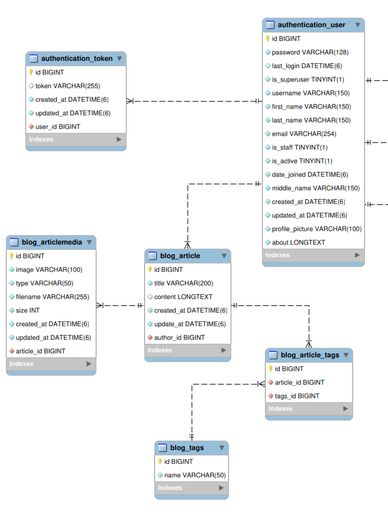

# INSTAILY ACADEMY WEB DEVELOPMENT BOOTCAMP 2024
## Simple Blog

### Objective

To implement a blog (this project acts as a revision for lessons learned at Instaily Academy Web Development Bootcamp 2024) 

### Features Implemented

- Authentication system, complete with otp system and forgot password functionality
- User can view and post articles

### Features planned

These features have been postponed due to time constraints, but will be visited upon in the future.

- Adding Google Login/Registration to Authentication
- Adding payment system for donation
- Adding comments and likes system

### Database Design

<figure>
    
    <figcaption><b>Blog Database Plan Layout [Extracted using MySQL Workbench]</b></figcaption>
</figure>

### Technologies Used

- Django Framework
- Mailhog For Fake SMTP
- Bootstrap 5
- Extras
    - Alphine Js
    - HTMX
    - Tinymce
    - Lorem Picsum
    - Dicebear
    - AOS

## Instructions

1. Dowload or clone the project into your local system
2. You need a virtual environment to install and use Django and other packages. All required packages are provided in the install scripts.
    - If you do not have venv installed, use the command <code> pip install virtualenv </code> 
    - For Linux
        - You may need to run the command <code> chmod +x ./install.sh</code>
        - Then, simply run <code>./install.sh</code> and wait for the packages to install
        - To activate venv, run the command <code>source venv/bin/activate</code>. Make sure you are in the same directory as the new venv path
        - Alternatively, you could use the provided requirements.txt file to install. To do so, simply run the command <code>pip install -r requirements.txt</code>. In that case, you need to first initialize and activate the virtual environment manually by running the command <code>python3 -m venv venv</code> and then running the command <code>source venv/bin/activate</code> to activate.
    - For windows
        - You may need to run the command <code>Set-ExecutionPolicy Unrestricted -Scope Process</code> to run scripts
        - Then, simply run <code>install.bat</code> and wait for the packages to install
        - To activate venv, run the command <code>venv\Scripts\activate</code>. Make sure you are in the same directory as the new venv path
        - Alternatively, you could use the provided requirements.txt file to install. To do so, simply run the command <code>pip install -r requirements.txt</code>. In that case, you need to first initialize and activate the virtual environment manually by running the command <code>python3 -m venv venv</code> and then running the command <code>source venv/bin/activate</code> to activate.
3. Go into the project directory from the command line.
4. Remove .example from provided .env file and setup valid credentials
    - NOTE: You can simply use the sqlite3 database generated by Django. This project also considers using MySQL, so if you want to connect to a MySQL database, make sure that you have MySQL installed on your system and that you have the correct credentials. <strong>This project at the moment does not consider any other databases other than sqlite3 or MySQL.</strong>       
5. If you are using Mailhog, you need to launch it before running the project. While the project itself does not require MailHog to run successfully, it still needs it open for any otp or password change requests.
    - Alternatively, you can simply use Mailtrap, which is a better solution than Mailhog. In that case, set the appropriate credentials, which you can get from the official site, in the .env file. 
6. You then need to seed the data and the users. Simply run the following commands for seeding functionalities (make sure you have a good internet connection to get images, and the delete commands take care of the images too):-
    - <code>python manage.py seed_users [--users]</code>: This should seed a set number of users. Use the users argument to set how many users you want to seed (Default is 40). This command also provides a file with details for the created users.
    - <code>python manage.py delete_users</code>: This should delete all <strong>non-staff</strong> users.
    - <code>python manage.py seed_data [--articles]</code>: This should seed a set number of articles. Use the articles argument to set how many articles you want to seed (Default is 50).
        - Optionally, there is another argument <code>[--number_of_images_in_content]</code> which determine how many images are to be included into the content (Default is 2).
    - <code>python manage.py delete_data</code>: This should delete all articles from the database.

7. After seeding the database, run the server using the command <code>python manage.py runserver</code>, and access it via the link [127.0.0.1:8000/blog](127.0.0.1:8000/blog). Register yourself and login to the site.
